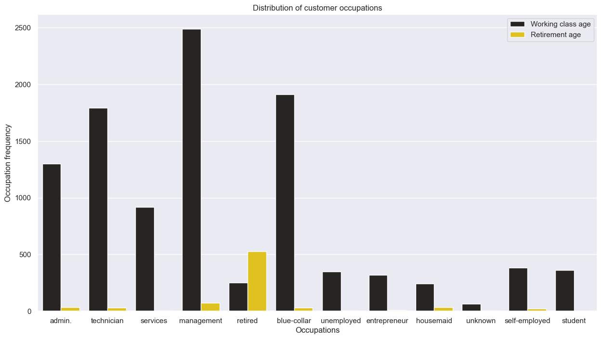

# Long-term-Investor-Prediction-with-Machine-Learning-Engaging-with-the-Investment-Community
This project will aim to employ machine learning for the task of predicting the efficacy of telemarketing campaigns run by banking institutions.

## Overview

This repository embodies a machine learning project that analyzes the customer data of one of the leading investment banks. Here, I predicted long-term deposit makers and investors in order to enhance customer engagement, optimize resource allocation, and drive long-term profitability as far as the investment bank is concerned. This project will be carried out using the **CRoss Industry Standard Process for Data Mining *(CRISP-DM)*** methodology, which generally is characterized by six phases.

## CRISP-DM <be>

  

1. Business understanding.
2. Data understanding.
3. Data preparation.
4. Data modelling.
5. Model Evaluation.
6. Model development.

## Objectives

This would be an immense boon to them in the following ways:

1. Provide a likelihood estimation as to the chances of a customer buying long-term deposits.
2. Provide good plan as to the customers to focus more attention on.
3. Provide some information as to the efficacy of telemarketing campaigns.

## Business Understanding

EliteBank Investment Services is a leading financial institution specializing in investment banking, asset management, and wealth advisory services. To improve their profitability, they intend to run a new telemarketing campaign to bring in fresh investments. To this end, they would like to leverage the data obtained from previous campaigns to forecast how likely they are to convince customers to invest.

## Data Understanding

Data understanding basically involves performing EDA on the obtained data. EDA is the process of sifting through data with the goal of extracting insights. These insights allow a better understanding of the available data and what can be done with it. They can also be used for guided preparation of the dataset in the appropriate manner. Just like regular analysis, EDA begins with a set of questions and/or hypotheses. The EDA process will then prove or disprove these hypotheses, and hopefully, reveal other points of inquiry along the way.

#### Age distribution of the bank customers

  

Observing the distribution of customer ages gives the impression that most customers are within their younger years. As such, it is a reasonable expectation that most of the customers to be employed in some gainful manner, as opposed to older, senior citizens, who are more likely to be retired.

We can confirm this hypothesis by visualizing the distribution of the  job feature.

#### Occupation of the customers

  

As can be seen from the visualization, most of the occupations are dominated by the young working class, while the retirement sector is dominated by older citizens, lending some credence to the earlier hypothesis.

Also, it is observed that the __unemployed__ segment is completely comprised of young, able-bodied people who should be put to work. As these people have no discernable source of income, __EliteBank__ might be well-advised to pay as little attention as possible to people in this segment when implementing their telemarketing strategies.

In addition, some of the customers were observed to have no records with the bank as regards their source of income (i.e., the __unknown__ segment). It would be a prudent move to rectify this oversight in order to target this set of people more effectively.

#### Loan default status of the customers

  

__Observation__:

From the chart above, it is obvious that:

+ A large majority of the customers have not defaulted on any personal loans.
+ The likelihood of a customer defaulting on a housing loan is almost random. This may be due to the fact that housing loans usually take longer to pay back, and if you are repaying a loan long enough, there might come a point when a payment default will occur.

This might imply one of two things:

+ Most people do not max out their credit line, and/or,
+ Most people do not use credit at all.

#### Feature correlation

  

From the visual heatmap above, there is very little multicollinearity in the dataset. Beyond that, it is obvious that most of the features exhibit low correlations with one another and with the target variables themselves. This may be taken as a mix of good and bad news.

The good news is that there is little colinearity among the features. This is good for feature independence, which might imply that each variable encodes information that might be relatively orthogonal to the information encoded within other variables. The bad news is, that any model trained in these features might have a difficult time learning anything from the data, as the target variable has little correlation with the independent variables.

More specifically, the target exhibits the best level of correlation with the:

+ __balance__,
+ __duration__,
+ __pdays__ and
+ __previous__.

## Data Preparation

  

Based on the *__Data Implications__* discovered prior, the following steps will be experimented upon for the data preparation stage.

1. __Split Data__: Split the data into train and test sets.
2. __Feature Encoding__: Encode categorical features.
3. __Feature Scaling__: Some features display large magnitudes/ranges (e.g., __balance__ and __duration__). These will need to be scaled.

## Data Modelling

  

1. Logistic Regression
2. ExtraTrees
3. CatBoost models
   

Based on our final observations, the AdaBoost model seems to do the best in terms of magnitudes. However, in terms of generalization, the logistic regression and CatBoost models have it beat with ~1.0% and ~5.0% errors respectively.

Purely based off of generalization errors, the logistic regression model beats the others out completely. For this reason, a decision can be made to go for it.

The logistic regression model can be difficult to tune, as it has very few hyperparameters. The CatBoost model, on the other hand has a good number of hyperparameters that can be tuned to not only improve performance, but also reduce generalization error. As such, the CatBoost model is also a good fit.

## Hyperparameter Tuning 

  

Based on our final observations from the optimization process, we have not been able to improve the models. This may be due to:

1. Insufficient data
2. Focusing on a small/wrong range of hyperparameters.
3. Focusing on the wrong hyperparameters.

Further optimization of the models might result in better models. This can be explored further. At this point, either model performs quite adequately. The final choice would be the Logistic Model, due to:

1. Lower generalization error,
2. Faster training, and
3. More explanability

## Technologies Used
**Ananconda**  
**Jupyter notebook**  
**Pandas, NumPy, Matplotlib, Seaborn**  
**Scikit-learn, logistic regression, catboost, random forest**  
